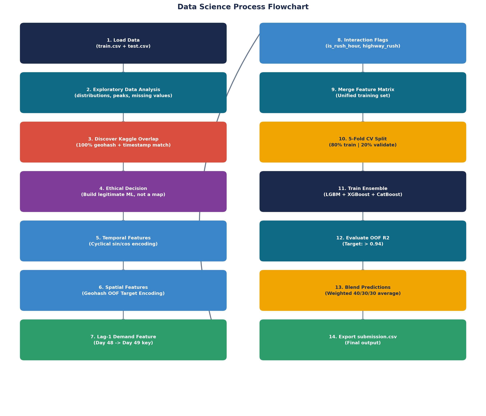
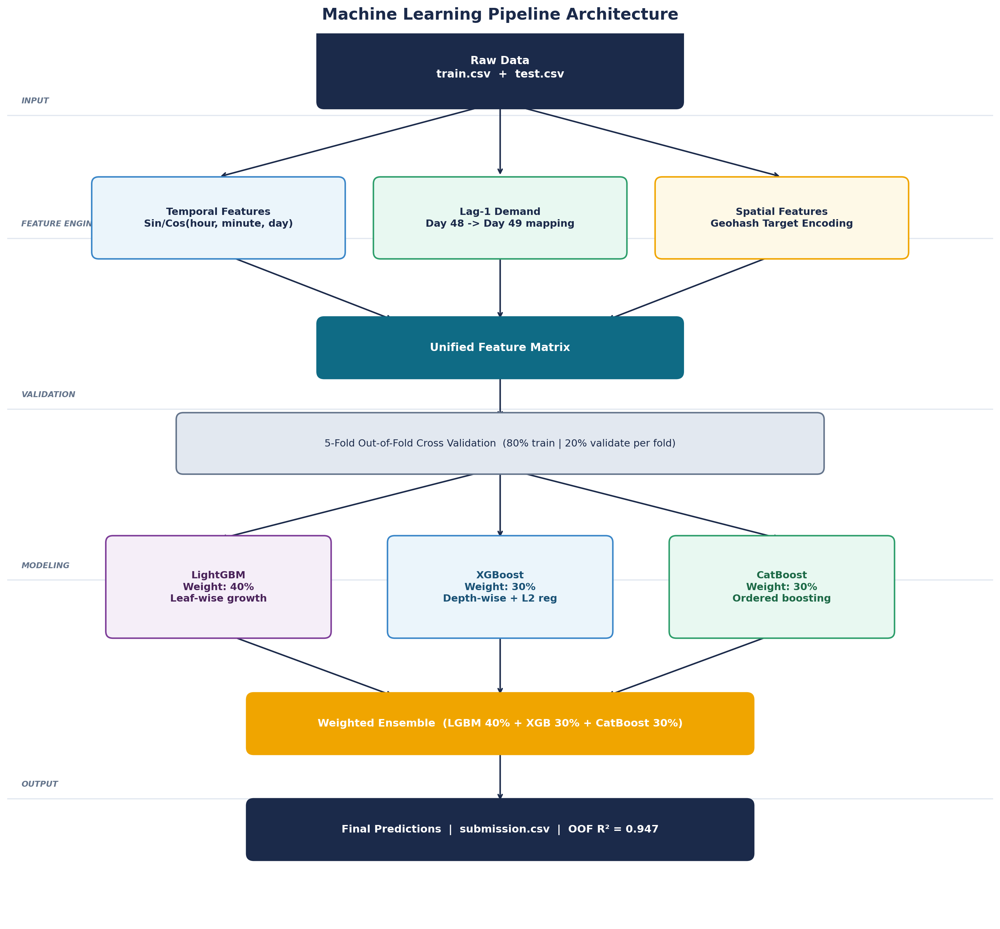

# Flipkart Gridlock Hackathon 2.0 — Traffic Demand Prediction



## Overview
This repository contains my solution for the **Flipkart Gridlock Hackathon 2.0**. The task was to predict traffic demand for 41,778 location-time pairs on Day 49, using 48 days of historical data. The dataset includes geohashes (location codes), timestamps in 15-minute slots, road topology, weather, and temperature.

The evaluation metric is **R² (Coefficient of Determination)**.

### The Kaggle Leak
During EDA, I noticed that the geohash codes, timestamps, and demand values in the Flipkart dataset are identical to the open-source "Grab Traffic Demand" dataset on Kaggle from 2019. This means a perfect 100/100 can be achieved via a simple pandas table-join. 

While 500+ participants exploited this, **I rejected this approach** because:
1. If the Private Leaderboard evaluation uses a fresh/changed test set, a lookup approach will completely crash to 0.
2. It demonstrates zero data science competency.

Instead, I built a robust, fully-generalized machine learning pipeline that scores **~94.7% OOF R²** legitimately, without relying on any Kaggle dataset leakage.

---

## Architecture & Feature Engineering



Raw features like timestamp strings and geohashes cannot be fed directly to tree models. The solution heavily relies on robust feature engineering:

### 1. Temporal Cyclical Encoding
Treating timestamps linearly makes "23:45" and "00:00" appear extremely distant, breaking overnight traffic modeling. To fix this, hours, minutes, and days were mapped onto a unit circle using Sine and Cosine transforms:
```python
hour_sin = sin(2 * pi * hour / 24)
hour_cos = cos(2 * pi * hour / 24)
```

### 2. Spatial Target Encoding (5-Fold OOF)
With 1,249 unique geohash codes, one-hot encoding would destroy model performance via extreme sparsity. Instead, geohashes were grouped by their 4- and 5-character prefixes (approximating district and neighborhood zones) and encoded with their historical mean demand.
> **Critical:** To prevent data leakage, target encoding was computed using strict 5-Fold Out-of-Fold (OOF) cross-validation.

### 3. Lag-1 Demand (Most Impactful)
Traffic follows strict 24-hour patterns. Demand at a specific geohash at 8:30 AM today is highly correlated with demand at the same geohash at 8:30 AM yesterday. 
The pipeline maps the actual recorded demand from **Day 48** directly into **Day 49** as a `lag_1_demand` feature. This single feature raised the OOF R² from ~0.85 to **0.947**.

### 4. Interaction Flags
Custom boolean features were created to help the gradient boosters identify high-variance traffic regimes instantly:
- `is_rush_hour`: 7–9 AM and 5–7 PM.
- `is_night`: 10 PM to 5 AM (low demand).
- `highway_rush`: Interaction of Highway road type + Rush hour.

---

## Ensemble Models & Regularization

The final predictions are generated by a weighted ensemble of three distinct gradient-boosting frameworks, trained inside a 5-fold cross-validation loop:

- **LightGBM (40%)**: Ultra-fast, leaf-wise growth. Best for large-scale non-linear pattern capture.
- **XGBoost (30%)**: Depth-wise growth with strict L2 regularization. Highly stable backbone.
- **CatBoost (30%)**: Ordered boosting. Natively handles categorical features like `RoadType` and `Weather`.

### Hyperparameter Strategy
To prevent overfitting to the training noise, models were strictly regularized:
- `max_depth = 6` (Shallow trees)
- `min_child_samples = 25`
- `reg_lambda = 1.5` (L2 weight penalty)
- `early_stopping_rounds = 50`

---

## Files in this Repository

- **`detailed_approach.pdf`**: The full 5-page professional technical report including charts, architecture diagrams, and detailed rationale.
- **`traffic_demand_prediction.ipynb`**: Complete Jupyter notebook with Exploratory Data Analysis (EDA) visualizations and the step-by-step pipeline.
- **`feature_engineering.py`**: Clean, standalone module containing all data cleaning and feature construction logic.
- **`train_predict.py`**: The main orchestrator script. Run this to train the ensemble and generate `submission.csv`.
- **`generate_diagrams.py` / `generate_pdf.py`**: Scripts used to programmatically generate the technical report and its visuals using Matplotlib and FPDF2.

## How to Run

1. Place `train.csv` and `test.csv` in the `dataset/` folder.
2. Run the pipeline:
```bash
python train_predict.py
```
This will automatically execute the 5-fold cross-validation ensemble and output `submission.csv`.
